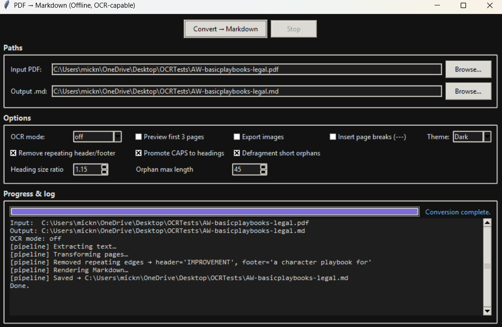

# PDF to Markdown Converter

**A refined, privacy first desktop and CLI tool that converts PDFs, including scanned documents into clean, structured Markdown. Built for researchers, professionals, and creators who demand accuracy, speed, and absolute data privacy.**

**Fast. Local. Intelligent. Fully offline.**


---

## 🛡️ Privacy & Security First

Many PDF converters silently upload documents to remote servers. **This tool does not.**

* **No uploads:** your files never leave your machine
* **No telemetry:** no usage tracking or analytics
* **No cloud processing:** all computation happens locally
* **No background requests:** completely offline operation

Every step, extraction, OCR, reconstruction, and rendering, happens **locally on your machine**.

### Trusted for Sensitive Workflows

Intentionally designed for environments where confidentiality is non-negotiable:

* 🏥 **Medical:** Clinical notes, diagnostic reports, patient records
* ⚖️ **Legal:** Case files, evidence bundles, attorney-client communications
* 🏛️ **Government:** Policy drafts, restricted documents, classified materials
* 🎓 **Academic Research:** Paywalled journals, unpublished materials, grant proposals
* 💼 **Corporate:** Financial reports, IP-sensitive designs, strategic plans

### Password-Protected PDFs — Secure Support

Full support for encrypted PDFs with security-first design:

✅ **Passwords never logged or saved** — Memory-only processing  
✅ **No command-line exposure** — Prevents process monitoring attacks  
✅ **Auto-cleanup** — Temporary files deleted immediately  
✅ **Interactive prompts** — Hidden input in GUI and CLI  

**GUI:** Modal password dialog with masked input (`*****`)  
**CLI:** `getpass` hidden terminal input

Supports all PDF encryption standards: 40-bit RC4, 128-bit RC4, 128/256-bit AES.

## Automatic Table Detection & Reconstruction

Your PDFs often contain tables split across blocks, columns, and various layout quirks. v1.5.0 introduces a robust table engine that handles:

- Column‑aligned tables (2+ spaces)
- Tab‑separated blocks
- Multi‑block vertical tables (PyMuPDF’s common block‑splitting behaviour)

### Table Rebuild Features
- Consistent grid reconstruction
- Row & column alignment
- Header detection
- Markdown table rendering
- Conservative heuristics to avoid false positives

This dramatically improves academic papers, financial documents, and structured reports.

---

## 🧮 Math‑Aware Preservation & LaTeX Output

Scientific documents finally convert cleanly.

The Math Engine automatically:

- Detects inline & display math regions
- Converts Unicode math to LaTeX (α → \alpha, √x → \sqrt{x})
- Converts superscripts/subscripts (x² → x^{2}, x₁₀ → x_{10})
- Avoids Markdown escaping inside math
- Keeps equations intact across line breaks

Perfect for physics, engineering, chemistry, and high‑level mathematics documents.

---

## 🖼️ Interface Preview

### Dark Mode (Default)



*Obsidian-inspired dark theme with purple accents for optimal late-night work sessions.*

**Toggle between themes instantly** — your preference is saved between sessions.

---

# Key Features

## 🎯 Accurate Markdown From Any PDF

- **Smart paragraph reconstruction** — Joins wrapped lines intelligently
- **Heading inference** — Uses font metrics to detect document structure
- **Bullet & numbered list detection** — Recognizes various formats (•, ○, -, 1., a., etc.)
- **Hyphenation repair** — Automatically unwraps "hy-\nphen" patterns
- **URL auto-linking** — Converts plain URLs into clickable Markdown links
- **Inline formatting** — Preserves **bold** and *italic* styling
- **Header/footer removal** — Detects and strips repeating page elements
- **Multi-column awareness** — Reduces cross-column text mixing

## 📊 Automatic Table Detection & Reconstruction (New)

- Column-aligned table detection (2+ spaces)
- Tab-separated table recognition
- Multi-block vertical table stitching
- Full Markdown renderer (pipes, alignment)
- Header row detection
- Conservative heuristics to avoid false positives

Perfect for academic papers, financial statements, and structured documents.

## 🧮 Math-Aware Extraction & LaTeX Preservation

- Detects inline and display math
- Converts Unicode math symbols to LaTeX (`α → \\alpha`, `√x → \\sqrt{x}`)
- Supports superscript/subscript conversion (`x² → x^{2}`)
- Keeps equations intact across line breaks
- Prevents Markdown escaping inside math blocks

Ideal for scientific PDFs in physics, mathematics, engineering, and chemistry.

## 📸 Scanned PDF Support (OCR)

- **Tesseract OCR** — Lightweight, accurate, works on all major platforms
- **OCRmyPDF** — High-fidelity layout preservation
- **Auto-detection** — Automatically identifies scanned pages
- **Configurable quality** — Balance between speed and accuracy
- **Mixed-mode support** — Handles PDFs with both digital text and scanned pages

## 🎨 Modern GUI Experience

- **Dark/Light themes** — Obsidian-style dark mode (default) with instant toggle
- **Live progress tracking** — Determinate progress bar with full logging
- **Error-aware console** — Real-time extraction and conversion logs
- **"Open Output Folder"** — Fast access to finished Markdown
- **Non-blocking conversion** — Cancel long-running jobs anytime
- **Keyboard shortcuts** — Power-user workflow
- **Persistent settings** — Theme, paths, options, and profiles saved between sessions

### 📋 Profiles System

**Built-in Profiles:**

- **Default** — Balanced settings for general documents
- **Academic Article** — Research papers, aggressive cleanup, no images
- **Slides / Handouts** — Preserve images, page breaks, minimal cleanup
- **Scan-Heavy / OCR-First** — Force OCR for scanned books and forms

**Custom User Profiles:**

- Save your own preset configurations
- Perfect for repeated document types (e.g., "Legal Briefs", "Lab Reports")
- Edit, rename, or delete user profiles anytime

### ⌨️ Keyboard Shortcuts

| Shortcut | Action |
|----------|--------|
| **Ctrl+O** | Select input PDF |
| **Ctrl+Shift+O** | Select output file |
| **Ctrl+Enter** | Start conversion |
| **Esc** | Stop/cancel |

---

## 🧠 Architecture Overview

A modular pipeline ensures clarity, stability, and extensibility.

```
PDF Input
    ↓
┌─────────────────┐
│  1. EXTRACT     │ ← Native PyMuPDF or OCR (Tesseract/OCRmyPDF)
└─────────────────┘
    ↓
┌─────────────────┐
│  2. TRANSFORM   │ ← Clean text, remove headers/footers, detect structure
└─────────────────┘
    ↓
┌─────────────────┐
│  3. RENDER      │ ← Generate Markdown with headings, lists, links
└─────────────────┘
    ↓
┌─────────────────┐
│  4. EXPORT      │ ← Write .md file + optional image assets
└─────────────────┘
    ↓
Markdown Output
```

### Module Breakdown

| Module | Purpose |
|--------|---------|
| **`extract.py`** | PDF text extraction & OCR orchestration |
| **`transform.py`** | Text cleaning, header/footer removal, structure analysis |
| **`render.py`** | Markdown generation with headings, lists, links |
| **`pipeline.py`** | End-to-end orchestration |
| **`models.py`** | Data structures (`PageText`, `Block`, `Line`, `Span`, `Options`) |
| **`utils.py`** | Cross-platform helpers, logging, text utilities |
| **`app_gui.py`** | Tkinter GUI with themes, profiles, progress tracking |
| **`cli.py`** | Command-line interface for automation |

**Design Philosophy:** Small modules with single responsibilities — easy to read, test, and extend.

---

## ⚙️ Installation

### Quick Install

```bash
# Clone repository
git clone https://github.com/M1ck4/pdf_to_md.git
cd pdf_to_md

# Install dependencies
pip install pymupdf pillow pytesseract ocrmypdf

# Launch GUI
python app_gui.py
```

### Platform-Specific Setup

#### Windows

1. **Install Tesseract OCR:**
   - Download: https://github.com/UB-Mannheim/tesseract/wiki
   - Run installer and add to PATH
   
2. **Install Python packages:**
   ```cmd
   pip install pymupdf pillow pytesseract
   ```

#### macOS

```bash
# Install Tesseract
brew install tesseract

# Install OCRmyPDF (recommended)
brew install ocrmypdf

# Install Python packages
pip install pymupdf pillow pytesseract ocrmypdf
```

#### Linux (Ubuntu/Debian)

```bash
# Install system dependencies
sudo apt-get update
sudo apt-get install tesseract-ocr ocrmypdf

# Install Python packages
pip install pymupdf pillow pytesseract ocrmypdf
```

### Windows Standalone Executable

Download the latest `.exe` from [Releases](https://github.com/M1ck4/pdf_to_md/releases) — no Python required.

**Note:** Tesseract must still be installed separately for OCR functionality.

---

## 🚀 Usage

### GUI Application

```bash
python app_gui.py
```

#### Quick Workflow

1. **Select Input PDF** — Browse
2. **Choose Output** — Auto-suggested `.md` file
3. **Select Profile** — Use built-in or custom settings
4. **Configure Options:**
   - OCR Mode: `off` / `auto` / `tesseract` / `ocrmypdf`
   - Export images to `_assets/` folder
   - Insert page breaks (`---`)
   - Remove repeating headers/footers
   - Adjust heading detection sensitivity
5. **Convert** — Click button or press Ctrl+Enter
6. **Monitor Progress** — Watch live logs
7. **Open Output** — Click folder link when done

### Command-Line Interface

#### Basic Usage

```bash
# Convert with default settings
python cli.py input.pdf

# Specify output path
python cli.py input.pdf -o output.md

# Enable auto-OCR detection
python cli.py input.pdf --ocr auto

# Force Tesseract OCR + export images
python cli.py scan.pdf --ocr tesseract --export-images

# Preview first 3 pages only
python cli.py large.pdf --preview-only
```

#### All CLI Options

```bash
python cli.py INPUT_PDF [OPTIONS]

Options:
  -o, --output PATH        Output Markdown file (default: INPUT.md)
  --ocr MODE              OCR mode: off|auto|tesseract|ocrmypdf (default: off)
  --export-images         Export images to _assets/ folder
  --page-breaks           Insert --- between pages
  --preview-only          Process only first 3 pages
  --no-progress           Disable progress bar
  -q, --quiet             Suppress log messages
  --version               Print version and exit
```

#### Batch Processing

```bash
# Process all PDFs in directory (Bash)
for pdf in *.pdf; do
    python cli.py "$pdf" --ocr auto
done

# Windows PowerShell
Get-ChildItem *.pdf | ForEach-Object { python cli.py $_.FullName --ocr auto }
```

---

## 🧩 OCR Strategy

### Auto-Detection & Engine Selection

| Platform | Primary OCR | Fallback | Notes |
|----------|-------------|----------|-------|
| **Windows** | Tesseract | Native PyMuPDF | Fast, lightweight |
| **macOS** | OCRmyPDF | Tesseract | Best layout preservation |
| **Linux** | OCRmyPDF | Tesseract | Ideal for servers |

### OCR Modes Explained

- **`off`** — Fast native text extraction (for born-digital PDFs)
- **`auto`** — Detects scanned pages automatically, applies OCR only when needed
- **`tesseract`** — Force page-by-page OCR (scanned books, forms)
- **`ocrmypdf`** — Maximum layout fidelity (complex documents, tables)

### Scanned PDF Detection

The `auto` mode analyzes the first 3 pages for:
- Text density (< 50 chars/page = likely scanned)
- Large images covering >30% of page area
- Combined low text + high image coverage triggers OCR

---

## 📊 Configuration Options

### Key Settings

**Heading Size Ratio** (`1.0` to `2.5`, default `1.15`)
- Font size multiplier for heading detection
- Lower = more headings, Higher = fewer headings
- Example: Body text 11pt → headings must be ≥12.65pt

**Orphan Max Length** (`10` to `120`, default `45`)
- Maximum characters for orphan line merging
- Short isolated lines get merged into previous paragraph

**CAPS to Headings** (default: `True`)
- Treats ALL-CAPS or MOSTLY-CAPS lines as headings

**Remove Headers/Footers** (default: `True`)
- Detects repeating text across 3+ pages
- Removes "Page N", "- - 1", footer patterns

**Defragment Short Lines** (default: `True`)
- Merges short orphan lines into paragraphs
- Improves reading flow

### Profile Storage

Settings saved to: `~/.pdfmd_gui.json`

Safe to edit manually for advanced customization.

---

## 🗂️ Example Output

### Before (PDF)
```
INTRODUCTION
This  is  a  para-
graph with hyph-
enation.
• Bullet one
• Bullet two
Page 1
```

### After (Markdown)
```markdown
# Introduction

This is a paragraph with hyphenation.

- Bullet one
- Bullet two
```

**Improvements:**
- ✅ Hyphenation repaired (`para-graph` → `paragraph`)
- ✅ Extra spaces normalized
- ✅ Bullets converted to Markdown
- ✅ Page numbers removed
- ✅ Heading properly formatted

---

## 🦯 Performance Tips

### For Large Documents (100+ pages)

1. **Test with preview mode first:**
   ```bash
   python cli.py large.pdf --preview-only --ocr auto
   ```

2. **Disable OCR if not needed:**
   ```bash
   python cli.py text-only.pdf --ocr off
   ```

3. **Only export images when necessary** — each image adds processing time

### For Slow Systems

1. **Use Tesseract instead of OCRmyPDF** — faster but less accurate
2. **Close other applications** — OCR is CPU-intensive
3. **Process in batches** — split large PDFs first

### Batch Processing with Parallel

```bash
# Process 4 PDFs simultaneously (Unix)
find . -name "*.pdf" | parallel -j 4 python cli.py {} --ocr auto
```

---

## 🛠️ Troubleshooting

### "PyMuPDF (fitz) is not installed"

```bash
pip install pymupdf
```

### "Tesseract binary is not available on PATH"

**Windows:** Reinstall Tesseract and check "Add to PATH"  
**macOS:** `brew install tesseract`  
**Linux:** `sudo apt-get install tesseract-ocr`

Verify: `tesseract --version`

### "OCRmyPDF not found"

```bash
pip install ocrmypdf
```

Or on macOS: `brew install ocrmypdf`

### OCR Output is Poor Quality

1. Check original scan quality — blurry scans won't improve
2. Try `--ocr ocrmypdf` instead of `tesseract`
3. Ensure Tesseract language data is installed
4. Use higher DPI (requires code modification)

### Password Dialog Not Appearing (GUI)

- Ensure PyMuPDF is up to date: `pip install --upgrade pymupdf`
- Check that PDF actually requires a password (not just restricted)

---

## 🤗 Contributing

Contributions welcome! You can help by:

- Testing with difficult PDFs (scanned, multi-column, handwritten)
- Improving OCR heuristics and accuracy
- Enhancing Markdown formatting logic
- Expanding profile presets
- Adding unit tests

### Development Setup

```bash
git clone https://github.com/M1ck4/pdf_to_md.git
cd pdf_to_md

# Create virtual environment
python -m venv venv
source venv/bin/activate  # or venv\Scripts\activate on Windows

# Install dependencies
pip install -r requirements.txt

# Run tests (if available)
pytest

# Launch GUI
python app_gui.py
```

---

## 📜 License

MIT License. Free for personal and commercial use.

See [LICENSE](LICENSE) file for details.

---

## 🙏 Acknowledgments

Built with:
- [PyMuPDF](https://pymupdf.readthedocs.io/) — Fast PDF rendering and text extraction
- [Tesseract OCR](https://github.com/tesseract-ocr/tesseract) — Google's open-source OCR engine
- [OCRmyPDF](https://ocrmypdf.readthedocs.io/) — High-quality OCR layer addition
- [Pillow](https://pillow.readthedocs.io/) — Image processing
- [pytesseract](https://github.com/madmaze/pytesseract) — Python Tesseract wrapper

---

**Free. Open. Useful. Private. Always.**
